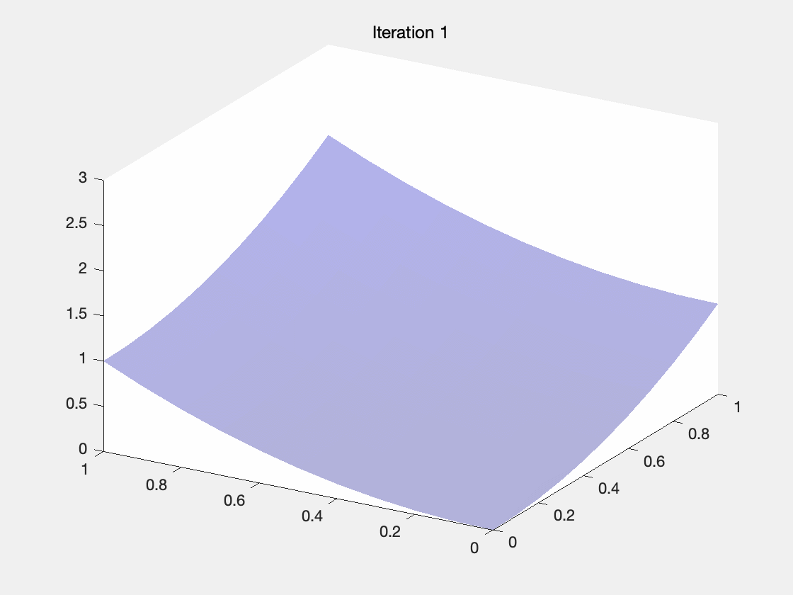

# Optimization-Theory-and-Methods

本仓库是对最优化方法的介绍和MATLAB代码复现。

## 1. 最速梯度下降算法

最速下降算法主要用于寻找函数的局部最小值。该方法的基本思想是，从初始点开始，沿着函数的梯度（即最陡的下降方向）进行迭代搜索，以期望找到函数的最小值。这种方法每一步都尽可能地减少函数值，因此称为“最速”下降法。

该算法的关键在于如何选择步长和下降方向。算法从一个初始点出发，通过迭代不断更新位置，每次迭代选择一个新的搜索方向，并利用线搜索技术找到最优的步长。线搜索可以是精确的，也可以是非精确的，其目的是在当前方向上找到使得函数值减小最多的步长。

算法的收敛性质依赖于目标函数的性质和选择的步长策略。当目标函数是严格凸的且二次的，最速下降法具有线性收敛性。这意味着靠近最优解时，算法的收敛速度会变慢，尤其是当接近最优值点时，收敛速度会显著下降。此外，相邻两步的搜索方向是正交的，这可能导致“锯齿现象”，即算法可能在最优解附近徘徊而难以快速收敛。

最速下降法中的关键计算和公式包括以下几部分：
1. 梯度计算：

  最速下降法在每次迭代中使用梯度来确定下降的方向。梯度是多变量函数在给定点的方向导数向量, 指向函数增长最快的方向。因此, 负梯度方向即是函数下降最快的方向。梯度的数学表达式为:

$$
\nabla f(x)=\left[\frac{\partial f}{\partial x_1}, \frac{\partial f}{\partial x_2}, \ldots, \frac{\partial f}{\partial x_n}\right]^T
$$

其中 $f$ 是目标函数， $x=\left[x_1, x_2, \ldots, x_n\right]^T$ 是变量向量。

2. 迭代公式:

  在确定了下降的方向后, 需要计算下一步的位置, 这通过以下迭代公式完成：

$$
x_{k+1}=x_k-\alpha_k \nabla f\left(x_k\right)
$$

​	其中 $\alpha_k$ 是第 $k$ 次迭代的步长, 通过线搜索算法确定, 以确保在该方向上取得函数值的足够下降。

3. 步长选择 (线搜索)：

  线搜索是用来确定步长 $\alpha_k$ 的一种方法, 目的是找到一个使得 $f\left(x_k-\alpha_k \nabla f\left(x_k\right)\right)$ 达到最小的 $\alpha_k$ 。精确线搜索要求计算使得下式成立的 $\alpha$ :
$$
\min _{\alpha>0} f\left(x_k-\alpha \nabla f\left(x_k\right)\right)
$$

​	非精确线搜索则不需要精确计算 $\alpha$, 而是找到一个“足够好”的 $\alpha$ 值, 常用的方法包括Armijo规则等。
4. 算法停止准则:

  算法的停止准则基于梯度的范数, 即当 $\left\|\nabla f\left(x_k\right)\right\|$ 小于预设的阈值时, 认为已经达到局部最小值附近, 算法停止。
