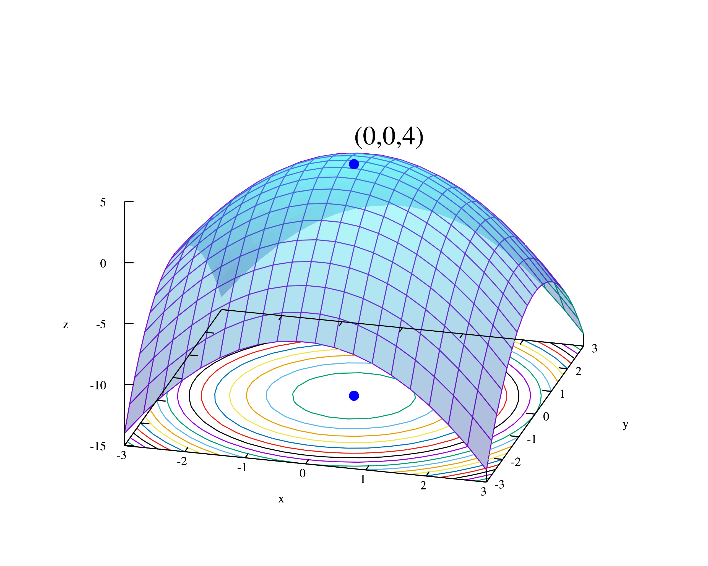

# Nonlinear-Numerical-Optimization-Methods

非线性数值优化方法的Matlab代码仓库，并给出了对应的数值优化问题样例，参见./utils

`gradient_descent_method`：梯度下降法

`armijo_search_method`：Armijo搜索步长准则

`damp_newton_method`：阻尼牛顿法

`revised_newton_method`：修正牛顿法

`fr_conjugate_gradient_method`：FR共轭梯度法

`trust_region_method`：信赖域法

`trust_region_quadratic_model`：光滑牛顿法解决信赖域子问题

`l_m_least_squares_method`：Levenberg-Marquardt 最小二乘法

`quadratic_Lagrangian`：拉格朗日二次优化法

`exterior_penalty_method`：外罚函数法

`interior_penalty_method`：内罚函数法

`genetic_algorithm`：遗传算法

## 参考文献

[1] 非线性最优化理论与方法 (第三版) 王宜举, 修乃华
